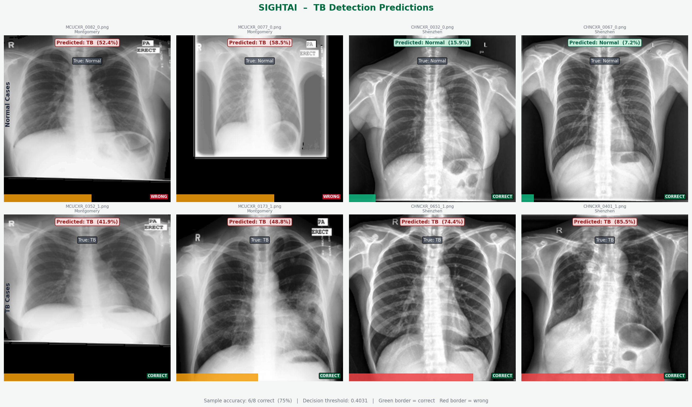
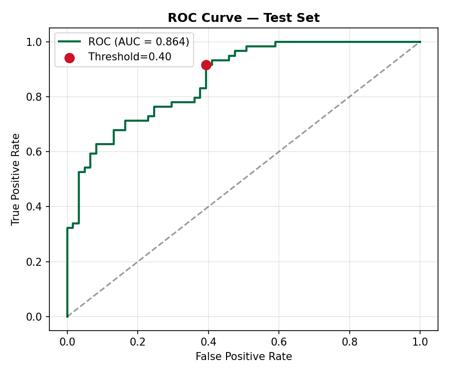
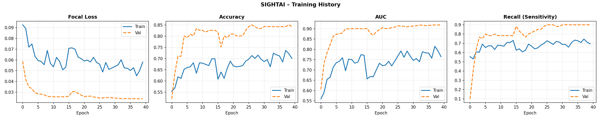

# SIGHTAI — AI-Powered Tuberculosis Detection Platform

> An end-to-end clinical decision-support platform for tuberculosis screening from chest X-rays, built for deployment in Ghana.



---

## Overview

SIGHTAI combines deep learning with a human-in-the-loop clinical review workflow to assist healthcare professionals in detecting tuberculosis (TB) from chest X-rays. The system provides AI predictions, explainable heatmaps (Grad-CAM), and a structured process for clinicians to review, override, and record their final decisions.

Built using the **Montgomery** and **Shenzhen** TB chest X-ray datasets (~800 images), the model achieves **91.5% sensitivity** — meaning it catches 9 out of 10 TB cases, which is critical for a screening tool where missed cases carry high clinical risk.

---

## Features

### AI Analysis
- **DenseNet121** transfer learning (CheXNet architecture)
- **Focal Loss** to focus training on hard examples
- **CLAHE** contrast enhancement matching the training pipeline at inference
- **ROC-tuned threshold** (sensitivity ≥ 90% constraint)
- Three risk levels: **Low / Inconclusive / High**

### Explainability
- **Grad-CAM** heatmap showing which lung regions drove the prediction
- Three viewing modes: Overlay, Original, Side-by-Side
- Dynamic AI reasoning text based on probability

### Human-in-the-Loop
- Clinician review form: patient info, clinical decision (Agree / Override / Uncertain)
- Recommended action and urgency level
- Printable decision record with unique review ID

### Analytics Dashboard
- Agreement rate, override rate, avg TB probability
- Risk level distribution, clinician decision breakdown, top facilities
- Full searchable and filterable review history table
- CSV export of all reviews

---

## Model Performance

| Metric | Value |
|---|---|
| Sensitivity (Recall) | **91.5%** |
| Specificity | 60.7% |
| Precision | 69.2% |
| F1 Score | **78.8%** |
| Decision Threshold | 0.403 (ROC-tuned) |
| True Positives | 54 |
| False Negatives | 5 |

> Threshold tuned to prioritise sensitivity ≥ 90% — in TB screening, missing a case is far more dangerous than a false alarm.





---

## Project Structure

```
SIGHTAIGH/
├── api/
│   ├── main.py          # FastAPI app — all endpoints
│   ├── inference.py     # Model loading, preprocessing, prediction
│   └── gradcam.py       # Grad-CAM heatmap generation
├── model/
│   ├── architecture.py  # DenseNet121 + Focal Loss
│   └── train.py         # Two-phase training + threshold tuning
├── data/
│   └── pipeline.py      # CLAHE, augmentation, tf.data pipeline
├── frontend/
│   └── index.html       # Full single-page app (Analysis + Dashboard)
├── notebooks/
│   └── 01_eda.ipynb     # Exploratory data analysis
├── saved_models/        # Training artifacts (model excluded from repo)
│   ├── optimal_threshold.json
│   ├── test_metrics.json
│   ├── training_history.json
│   ├── roc_curve.png
│   └── training_history.png
├── config.py            # Central configuration
├── predict_samples.py   # Visual prediction grid script
├── Dockerfile
├── docker-compose.yml
└── requirements.txt
```

---

## Setup

### 1. Clone the repository
```bash
git clone https://github.com/GirlEf/SIGHTAI.git
cd SIGHTAI
```

### 2. Download the datasets
Download both datasets from Kaggle and place them in the project root:

- [Montgomery County Chest X-ray](https://www.kaggle.com/datasets/raddar/tuberculosis-chest-xrays-montgomery) → `tuberculosis-chest-xrays-montgomery/`
- [Shenzhen Hospital Chest X-ray](https://www.kaggle.com/datasets/raddar/tuberculosis-chest-xrays-shenzhen) → `tuberculosis-chest-xrays-shenzhen/`

### 3. Create virtual environment and install dependencies
```bash
python -m venv .venv

# Windows
.venv\Scripts\activate

# macOS / Linux
source .venv/bin/activate

pip install -r requirements.txt
```

### 4. Train the model
```bash
python model/train.py
```
Training runs two phases (~40 epochs total) and saves the model and threshold to `saved_models/`.

### 5. Start the API
```bash
uvicorn api.main:app --reload --host 0.0.0.0 --port 8000
```

Open **http://localhost:8000** in your browser.

---

## Docker Deployment

```bash
# Build and start
docker-compose up --build

# Run in background
docker-compose up -d --build
```

The `saved_models/` directory is mounted as a volume so the trained model and reviews database persist between container restarts.

> **Note:** Train the model locally first so `saved_models/sightai_model.keras` exists before building the Docker image.

---

## API Endpoints

| Method | Endpoint | Description |
|---|---|---|
| `GET` | `/` | Serve the web frontend |
| `GET` | `/health` | Model status and threshold |
| `POST` | `/predict` | Upload X-ray → AI prediction + Grad-CAM |
| `POST` | `/review` | Submit clinician review |
| `GET` | `/reviews` | List reviews (filterable, paginated) |
| `GET` | `/reviews/{id}` | Get review by ID |
| `GET` | `/reviews/export/csv` | Download all reviews as CSV |
| `GET` | `/stats` | Aggregate analytics |
| `GET` | `/docs` | Interactive API documentation (Swagger) |

### Example prediction request
```bash
curl -X POST "http://localhost:8000/predict?explain=true" \
  -F "file=@chest_xray.png"
```

### Example response
```json
{
  "filename": "chest_xray.png",
  "tb_probability": 0.7812,
  "label": "TB Detected",
  "risk_level": "High",
  "confidence": 0.7812,
  "message": "Radiological features suggestive of tuberculosis detected...",
  "threshold_used": 0.4031,
  "gradcam_image": "data:image/png;base64,..."
}
```

---

## Tech Stack

| Layer | Technology |
|---|---|
| Model | TensorFlow / Keras, DenseNet121 |
| Explainability | Grad-CAM (Selvaraju et al., 2017) |
| Preprocessing | CLAHE via scikit-image |
| Backend | FastAPI, SQLite |
| Frontend | Vanilla HTML/CSS/JS (no framework) |
| Deployment | Docker, Uvicorn |

---

## Datasets

| Dataset | Institution | Images | TB Cases | Normal |
|---|---|---|---|---|
| Montgomery | Montgomery County, USA | 138 | 58 | 80 |
| Shenzhen | Shenzhen Hospital, China | 662 | 336 | 326 |
| **Total** | | **800** | **394** | **406** |

Both datasets are TB-specific screening programmes. Labels are binary: **Normal (0)** vs **TB (1)**.

---

## Disclaimer

SIGHTAI is an AI-powered **decision-support tool** intended to assist qualified healthcare professionals only. It does not constitute a clinical diagnosis. All AI results must be reviewed and confirmed by a licensed clinician before any treatment decision is made.

---

## Author

**Abena Fosuaa Gyasi**
Built as an AI engineering project for TB screening in Ghana.
